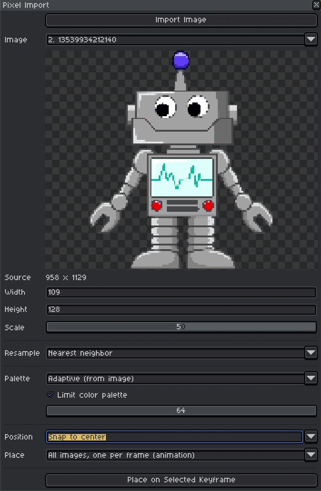

# Pixel Import

An Aseprite extension that brings any image in as editable pixel art, with a
live preview, without leaving the app.

  

  <a href="../../releases/latest"><b>Download</b></a> &middot;
  <a href="docs/DEVELOPING.md">Full documentation</a>

## Setup

1. Download `pixel-import.aseprite-extension` from the
   [latest release](../../releases/latest).
2. In Aseprite, go to **Edit > Preferences > Extensions > Add Extension** and
   pick the file. On Windows you can usually just double-click it instead.
3. Restart Aseprite.

The command appears at **File > Scripts > Pixel Import: Convert Image**.

To update, install the newer file the same way. To uninstall, use **Edit >
Preferences > Extensions > Uninstall**.

Windows, macOS and Linux. Built and tested against Aseprite 1.3.18.2 (API 41).

## Features

- **Live preview.** Every setting reconverts and repaints as you drag it.
  Nothing touches your sprite until you press Place, and the whole placement is
  a single undo step.
- **Recovers upscaled pixel art exactly.** A 32x32 sprite saved as a 512x512
  png is still a 32x32 sprite. Import finds the grid and gives back the
  original, pixel for pixel, with no averaging.
- **Batch import.** Select several files at once, or open a gif, and lay them
  out as animation frames or as separate layers.
- **Color reduction that suits the image.** Median cut picks a palette from the
  picture itself, or snap to the palette your sprite already uses - optionally
  spending only as many of its colors as you allow.
- **Four resampling filters.** Nearest neighbor by default, since it is the
  only one that cannot invent a color; area average, bilinear and bicubic for
  when the source is a photograph.
- **Places where you mean it.** Snap to the center or any corner, or click the
  canvas to position it, onto whichever layer and frame you have selected.

## Issues

Known limitations, so none of these come as a surprise:

- **It is a downscaler, not an artist.** Detail-heavy sources - faces, foliage,
  text - turn to mush at low resolutions, and no setting fixes that. Expect the
  result to be a starting layer you clean up by hand.
- **The default filter is wrong for photographs.** Nearest neighbor keeps one
  pixel in nine and discards the rest. If an imported photo looks speckled,
  switch Resample to *Area average*.
- **No cropping.** Crop before importing, in whatever you already use.
- **Output is capped at 256px** on the long side, and never exceeds the source's
  own resolution.

Found a bug, or want something it does not do?
[Open an issue](../../issues).

## License

MIT - see [LICENSE](LICENSE).
