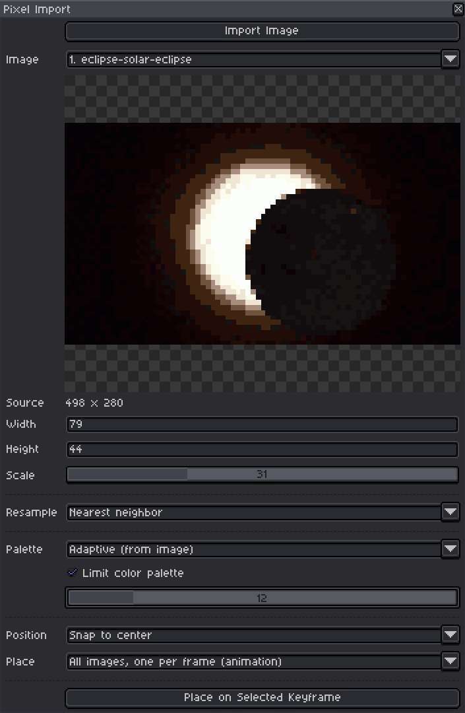

# Pixel Import - full documentation

Everything the [README](../README.md) leaves out: what every setting does, how
the conversion works, and the notes worth having before changing any of it.

Installing and the feature list live in the README; this file assumes you
already have it running.

## The window



The window reads top to bottom as the pipeline runs: what came in, how it is
converted, where it goes. The preview shows the converted result on a
checkerboard, at the size it will actually be placed. The destination controls
sit directly above the button that acts on them, rather than being separated
from it by every conversion setting.

**Import Image** opens the file browser straight away. Pick a picture and it
loads, detects its native resolution, sets Scale accordingly, and converts
immediately.

You can select several files at once. Everything imported lands in the **Image**
dropdown; choosing one previews it, and the settings below apply to whichever
is showing. Place steps to the next one automatically, so reopening the window
is ready for it.

A file that is one of several numbered images in a folder - 7.png beside 8.png
and 9.png - normally makes Aseprite ask whether to load the whole sequence as
an animation. That prompt is suppressed for the duration of the import and the
preference is put back afterwards, since it is a global setting and not this
extension's to keep. If a sequence loads anyway, nothing is lost: every frame
becomes its own entry in the Image dropdown. The same is true of a gif.

**Place on Selected Keyframe**, at the bottom, drops the result onto the active
layer and frame as one undo step, then closes the window.

Closing is not losing: every setting and the imported image itself survive, so
reopening the window puts you back exactly where you were, ready to place the
same image again somewhere else. That lasts as long as Aseprite is running.

## Where it goes

The destination is the **selected keyframe** - whatever layer and frame are
active in the timeline. There is no layer picker: Aseprite's own timeline is
the layer picker, and a second one in this window could only disagree with it.

| Setting | Choices |
|---------|---------|
| Position | **Snap to center** (the default), the four corners, or **Place with cursor**. |
| Place | **All images, one per frame (animation)** (the default), or **All images, one per layer (creates new layers)**. Grayed out when only one image is imported, since there is nothing to distribute. |

The selected layer is merged into, never overwritten - the cel grows to cover
both, and transparent pixels of the import do not punch holes in what is
underneath.

**One per frame** lays the batch along the timeline, starting at the selected
keyframe and extending the timeline if the batch is longer, merging into the
selected layer. Frames the artist already had are never removed.

**One per layer** stacks the batch in the current frame instead, each image on
a new layer of its own.

There is no "selected image only". One image is a batch of one, and one per
frame already means "put it on the selected keyframe" - which is what the
button says. A separate mode for it was a third way to describe the same
action.

Either way the whole batch is one undo step.

Snapping puts images flush against that part of the canvas immediately. Place
with cursor hands off to Aseprite's crosshair: the window closes and the image
lands centered where you click. For a batch that is a single click for the whole
set rather than one per image - ten clicks for ten frames would be tedious, and
an animation wants its frames aligned anyway.

Every parameter reconverts and repaints the preview as you drag it. Nothing is
written to your sprite until you press Place.

## Parameters

| Control | What it does |
|---------|--------------|
| Source / Width / Height | What went in, and what comes out. Width and Height are editable and locked to each other. |
| Scale | 1 to 100, where 100 is as large as the source can honestly go and 1 is a single pixel. Import sets it for you; drag it if you disagree. |
| Resample | Which filter combines the pixels. See below. |
| Palette | Where the colors come from: derived from the image, or borrowed from the sprite's own color bar. |
| Limit color palette | How many colors to spend. See below. |

There is no cropping. Crop before importing, in whatever you already use for
it - a tool that can only center-crop to a handful of ratios is worse than the
one you have.

## Scale and target size

Scale runs 1 to 100 and is linear: 50 is half of the maximum, 100 is the
maximum. The maximum is whichever is smaller of 256px on the long side, the
file's own resolution, or the working copy's - so scale 100 never invents
detail, and a 512px file that is really a 32px sprite stops at 32.

Width and Height are the same number stated as pixels, and both are editable.
They stay in step with Scale in both directions: drag Scale and they follow,
type a size and Scale moves to match. Whichever was touched last is the one
that decides, so a typed size is used exactly even where the slider could not
have landed on it. Selecting another image hands control back to Scale, because
a size typed for one picture means nothing for the next.

Width and Height are locked to the source's shape: type a width and the height
follows, and the other way round. A typed size is still held to the same
ceiling as the slider, so the fields show what actually happened rather than
what was asked for.

Backspacing a field empty leaves it empty - no 1 is shoved in while you are
mid-edit. Touching any other control runs a conversion, which fills the field
back in with the real value.

(`convert.run` will accept a mismatched width and height and squash the image
on purpose. The dialog does not offer it, because it is not something to fall
into by mistyping a number.)

## Palette and color limit together

These are not rival settings, and both apply at once.

**Palette** decides which colors are allowed. *Adaptive* derives them from the
image by median cut. *Current sprite palette* borrows the colors already in
the sprite's color bar, so an import lands in colors the sprite owns rather
than beside them. It reads the palette live, so editing the color bar and
nudging a slider picks up the change.

**Limit palette** decides how many of them to spend.

| Palette | Limit | Result |
|---------|-------|--------|
| Adaptive | off | Every color the downscale produced. Rarely reads as pixel art. |
| Adaptive | 16 | 16 colors chosen from the image by median cut. |
| Sprite | off | The sprite's whole palette is available. |
| Sprite | 16 | 16 colors, all of them the sprite's. |

That last row is the interesting one: median cut picks the 16 colors the image
actually wants, then each is snapped to the nearest color the sprite really
has. Going the other way - ranking the sprite's entries by how much area they
cover - would spend the whole budget on backgrounds and drop small bright
details. It can come back with fewer than asked when two wanted colors land on
the same entry, which is honest: the sprite has no third color there.

Edges are always hard: every pixel ends up fully opaque or fully gone. A soft
edge is the single most reliable way to stop a small image reading as pixel
art, so there is no reason to offer it as a choice.

## Resample methods

Called *Resample* rather than *Downscale* because it picks how pixels are
combined, not whether they shrink - and at full scale on detected pixel art it
is not scaling anything at all.

| Method | What it does | Use it when |
|--------|--------------|-------------|
| Nearest neighbor | Takes one source pixel and nothing else. The only filter that cannot invent a color. | The default. Right whenever the source is already pixel art, or you want an exact palette kept. Aliases badly on photos. |
| Area average | Averages every source pixel falling under the output pixel. | Photographs and detailed illustrations, where nearest throws away most of the picture. |
| Bilinear | Blends the 2x2 neighborhood around the sample point. | Softer than area on mild reductions. |
| Bicubic | Blends a 4x4 neighborhood, Catmull-Rom weights. Sharper, with slight overshoot at hard edges, which is clamped. | You want more bite than area average gives. |

One honest caveat: bilinear and bicubic sample a fixed small neighborhood, so
at large reductions they skip most of the source and alias, where area average
looks at all of it. They are here because they are the filters people expect to
find, not because they beat area average at shrinking a photo to 64px.

Nearest is the default because this is a pixel art tool, but it is the wrong
default for a photograph: it keeps one pixel in nine and throws the rest away.
If an imported photo looks noisy and speckled, that is the filter, not the
color limit - switch to area average.

All four are exact at 1:1, which matters because collapsing a detected grid
leaves the resample at 1:1 - so the native resolution round trip stays
pixel-perfect whichever method is selected. There is a test for that.

## Native resolution detection

Import works out what resolution the image really is, and sets Scale to match.

A 32x32 sprite exported as a 512x512 png is still a 32x32 sprite; the file just
carries every pixel 256 times over. Import finds that 16x grid and recovers the
original **exactly** - one source pixel per block, no averaging, every color
identical to the artwork it came from. There is a test that asserts precisely
that, pixel for pixel.

Detection looks for the largest integer factor whose blocks are flat, and
requires that a real fraction of neighboring blocks actually differ. That
second condition is what stops a smooth gradient reading as a grid of flat
blocks. It has a per-channel tolerance, so a png that has been through a lossy
round trip is still recognized, and it refuses factors that would reduce the
image below 4px - falling back to a smaller factor, which is still lossless.

Detected art starts at Scale 100, which is its native resolution exactly - the
working copy holds nothing finer, so full scale means the original artwork.

When there is no grid - a photo, a painting, anything that was never pixel art
- Scale is aimed at roughly 128px on the long side instead, and images already
smaller than that are left alone.

Either way it is only a starting point. The slider is still yours.

## How the conversion works

Two reductions, always in this order: resolution first, color second.

Downscaling averages neighboring pixels, which invents colors that were never
in the source. Quantizing afterwards collapses those back onto a small
deliberate palette. Doing it the other way round would spend palette entries on
detail that is about to be thrown away.

The downscale is an alpha-weighted area average, so transparent pixels do not
drag edges toward whatever sits in their unused color channels. The palette
reduction is median cut, split on a luma-weighted axis: the eye resolves green
detail far better than blue, so an equal numeric spread in blue earns fewer
palette entries.

Placing into an indexed or grayscale sprite routes through that sprite's own
palette, so the import lands in the colors the sprite already uses.

### What this is not

It is a downscaler, not an artist. Detail-heavy sources - faces, foliage, text,
anything with fine structure - turn to mush at low resolutions, and no
parameter here fixes that. What comes out is a starting point on its own layer:
expect to clean up silhouettes, stray pixels and outlines by hand. Simple,
high-contrast, well-silhouetted sources convert far better than photographs.

## Performance

Both the source image and the converted output are capped (1024px and 256px on
the long side). Sampling per output pixel is budgeted, so a conversion pass
costs roughly the same whether the source is 600px or 6000px - which is what
keeps the sliders live.

Defining Scale against what the source can actually give, rather than against
the file's own resolution, is what keeps the slider honest end to end. An
earlier version divided the file size by a "pixel size" figure, which left a
dead run at one end: a 4000px import gave the same clamped 512x383 for every
setting from 1 to 7. Every position of the Scale slider does something.

## Layout

```
main.lua           plugin entry, registers the menu command
src/convert.lua    loading, resampling, quantizing, color mode matching
src/place.lua      dropping the result into a sprite
src/ui.lua         the dialog
tests/run.lua      headless test suite
install.ps1        copies the runtime files into Aseprite, for development
build.ps1          packages the installable .aseprite-extension
```

`convert.lua` and `place.lua` hold everything testable and know nothing about
the dialog; `ui.lua` holds everything that needs a window and no logic worth
testing. That split is what lets a GUI-only extension have a real test suite.

`convert.load` reads an image from a path. The extension itself never calls it
- Aseprite's Open dialog hands back a sprite, so `convert.fromSprite` is the
route the button takes - but it is the module's path-based entry point and is
covered by the suite.

## Development

Aseprite on Windows does not attach stdout to the console, so the suite writes
its results to a file rather than printing them.

```powershell
& "<path to Aseprite.exe>" -b --script tests\run.lua
```

The Steam build lives at
`C:\Program Files (x86)\Steam\steamapps\common\Aseprite\Aseprite.exe`; the
standalone build is usually under `C:\Program Files\Aseprite\`. On macOS it is
`/Applications/Aseprite.app/Contents/MacOS/aseprite`.

Results land in `tests/run.results.txt` (gitignored), starting with a
`N passed, M failed` line. The suite runs headlessly against a real Aseprite,
so it exercises the actual API rather than a mock - which is the only way to
catch the sort of thing collected under "Notes" below.

The dialog itself cannot run headlessly: `Dialog{}` returns nil under `-b`. The
suite therefore load-checks `ui.lua` and tests everything behind it, and the
window has to be looked at by a human.

## Packaging a release

An Aseprite extension is just a zip of the runtime files with an
`.aseprite-extension` suffix and `package.json` at its root.

```powershell
.\build.ps1
```

That writes `pixel-import.aseprite-extension` (gitignored) from
`package.json`, `main.lua` and `src/`. Bump `version` in `package.json` first,
or Aseprite will not treat it as an upgrade over an installed copy.

The script writes archive entry names with forward slashes deliberately.
`Compress-Archive` uses Windows separators, which installs fine on Windows but
gives macOS and Linux users a single file named `src\convert.lua` instead of a
`src` folder - a broken extension that looks fine from the machine that built
it.

Attach the built file to a GitHub release:

```powershell
gh release create v0.2.0 pixel-import.aseprite-extension --title "Pixel Import 0.2.0" --notes "What changed."
```

## Notes for later

- `ChangePixelFormat` to indexed in batch mode produces a 256-entry all-black
  palette, so tests that need an indexed sprite build the palette explicitly
  with `Sprite:setPalette`. A test resting on that command measures Aseprite's
  conversion defaults, not this code.
- Aseprite's Lua parser rejects a UTF-8 BOM outright. Anything writing these
  files has to write plain UTF-8.
- The scripting API exposes no bare file-chooser call. Import borrows
  `app.command.OpenFile`, which is Aseprite's own Open dialog, then takes the
  pixels from the sprite it opened and closes it again. The alternative - a
  `Dialog:file` widget - costs an extra dialog and an extra click.
- Sprites cannot be used as table keys. Indexing `app.sprites` hands out a
  fresh wrapper each time, so `seen[sprite]` silently never matches even though
  `==` compares correctly. Key on `sprite.id`. `app.sprites` is also not
  ordered newest-last, so never assume the last entry is the one just opened.
- Test fixtures made of large flat blocks are themselves valid pixel grids, and
  native resolution detection will fire on them. Any fixture that is not
  testing detection wants odd sizes at odd offsets.
- `app.editor` is nil in batch mode, so `place.pick` returns false there and
  the caller falls back to centering.
- Check widgets fire `onclick`, not `onchange`. Wiring one to `onchange` leaves
  the handler silently dead - the box ticks and nothing happens until some
  other control triggers a pass, which reads as "the setting only works if you
  also drag a slider".
- Widgets are laid out left-aligned with no way to center one, so the preview
  canvas is deliberately the widest thing in the window. Anything wider would
  push the dialog out and leave the canvas sitting in a corner.
- Modifying any widget makes Aseprite lay the dialog out again, which discards
  a size the artist set by dragging the window edge - the window snaps back the
  moment anything is touched. `ui.preserveBounds` saves `dlg.bounds` around
  every batch of modifications and puts them back. It is re-entrant, because
  handlers call `recompute`, which preserves as well; an inner save would
  capture bounds the outer call had already disturbed and lock in the snap.
- Every widget in this dialog lands on a line of its own. A second unlabelled
  field, a bare `label` widget and a fixed-size `canvas` were all tried as a
  way to get `[w] x [h]` onto one row, and all three stacked. Width and Height
  are therefore two labelled rows; do not spend more time on it without first
  proving side-by-side widgets work here at all.
- `Dialog:number` fires `onchange` per keystroke, so a field is legitimately
  empty mid-edit. Coercing it to a valid number there fights the artist for the
  caret and shoves a 1 in as soon as they backspace. Ignore unparseable input
  and let the next conversion fill it back in.
- Place closes the window, but the crosshair callback outlives it, so every
  write to the dialog is wrapped and suppressed once closed.
- Cropping goes through the resampler as a rectangle rather than as a copied
  sub-image, so it costs nothing per pass. Watch for shadowing: the kernel
  filters accumulate into `acc`, not `r`, because `r` is the rectangle - naming
  it `r` compiled fine and failed at run time on every filter but area.
- `app.preferences.open_file.open_sequence` is `gen::SequenceDecision`: 0 ask,
  1 yes, 2 no. Batch mode loads sequences regardless of it, so the value cannot
  be verified headlessly - which is why importing per frame is the real defense
  and the preference is only the polish.
- The preview box is sized once per import from the source aspect ratio, not
  per conversion. Sizing it to the converted image makes it grow, shrink and
  re-center on every slider drag, exactly when settings are being compared.
- Dithering before quantization is the obvious next addition - it would buy a
  lot on gradients at low color counts.
